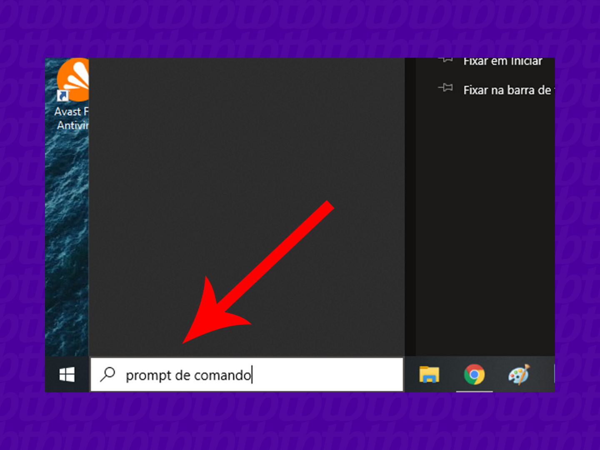
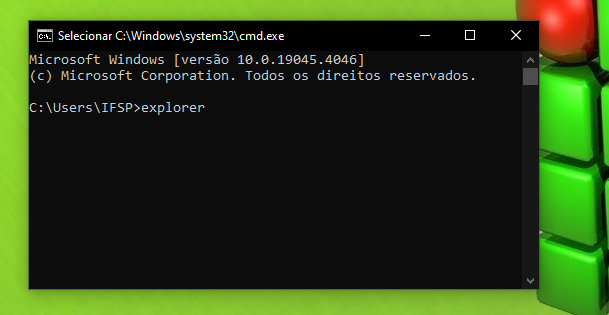

    
    <h1>Windows explorer</h1>
    
É programa, um explorador de arquivos do windows que permite a navegação do usuário entre arquivos e pastas.

    <ul>
        <li>Criar pastas e remover pastas.
        <li>Gerenciar e organizar arquivos, possibilitando uma maior facilidade para encontrar arquivos antigos.
    </ul>
    
É muito importante para quem trabalha ou esta sempre em contato com um computador, saber onde encontrar seus arquivos, pastas ou programas.

    <h3>Como encontrar o explorer</h3>
    
Existem algumas formas de acessar o explorer. Acessando-o na barra de taréfas(barra inferior na área de trabalho)

    
    
Apertando a tecla "windows" + tecla "e"

    
    
Abrindo o cmd(Command Prompt); digite "prompt de comando" na barra de pesquisa do windows

    
    
No prompt de comando digite "explorer" e o explorador do windows irá abrir

    

