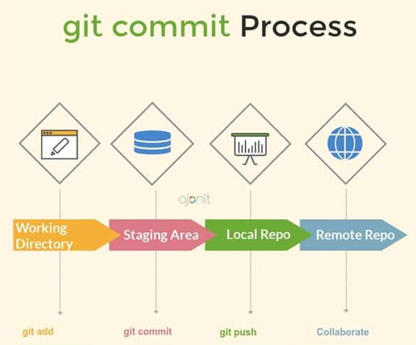

    

        <h3  style="text-align:center;">Do Git ao Github</h3>
        
        <ul style="text-align:center; list-style: none;">
        </ul>
    

    
Agora que entendemos como funcionar o Git, local, precisamos lançar nossas alterações para o Github, remoto.

    
Para vincular o Git com Github, precisamos configurar esse vinculo entre repositório local e remoto, além da branch local e da branch remota.

    <!-- Github to Git-->
    
Caso seu repositório do Github nao tenha nenhuma branch, o desenvolvedor pode simplesmente informar o repositório que deseja vincular que o Git configura, por padrao, a branch do Git com a do Github

    <h3>Do Github para o Git</h3>
    <!--Criar o processo-->

